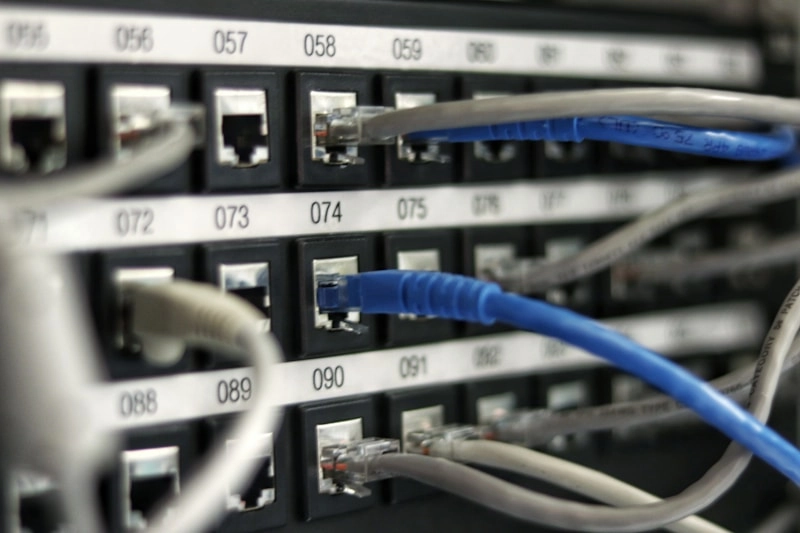

# 为什么你的独立服务器总是"明天才能好"?

如果你曾经因为服务器部署要等3天而错过产品发布,或者因为凌晨故障找不到技术支持而抓狂,那你大概能理解"即时开通"和"24小时在线"到底意味着什么。GTHost的美国独立服务器不是那种"提交工单-等待回复-再等审核-最后部署"的传统流程,而是下单后几分钟就能用的那种。对于需要快速响应市场、不想把时间浪费在等待上的企业来说,这不是锦上添花,是刚需。

---

## 美国服务器为什么成了"标配"?

美国是全球互联网的中心节点之一。选择部署在美国,不是为了赶时髦,而是因为这里确实有实实在在的优势:

- **网络延迟低**:北美地区访问速度快,对跨境电商和全球业务友好  
- **基础设施成熟**:Tier III级别数据中心,停电?基本不存在的  
- **带宽成本合理**:相比其他地区,美国的大带宽性价比更高  
- **扩展性强**:需要更多资源?随时升级,不用重新折腾

很多人以为独立服务器=贵。其实GTHost有不少经济型方案,性能不打折,价格却很友好。

## "即时开通"听起来像营销话术?

传统服务商的流程大概是这样的:提交订单→人工审核→分配硬件→安装系统→测试→交付。整个流程走下来,快的话1天,慢的话能拖到72小时。

GTHost的逻辑不太一样。他们把常用配置预先准备好,系统自动化部署,你下单后几分钟就能拿到root权限开始干活。👉 [不想再等"明天就好"?看看这个能让你立刻开工的方案](https://cp.gthost.com/en/join/72c7e6b2fc118929f9ede2978f008806)

这种速度的实际意义是什么?假设你在做促销活动,预计流量会暴涨,临时需要加机器。传统方案可能让你错过流量高峰,而即时部署意味着你能在最需要的时候顶上去。

## 全球布局不是说说而已

GTHost不只做美国市场。如果你的业务在加拿大有用户,或者需要覆盖欧洲,他们也有相应节点。这种覆盖范围的好处在于:你可以用一个服务商解决多地部署需求,不用分别对接不同供应商,省心。

对于需要全球CDN加速或者多地容灾备份的企业来说,这种"一站式"方案能减少不少沟通成本。

## 便宜就一定不靠谱?

很多人对"经济型独立服务器"有偏见,觉得便宜=性能差。但实际上,价格差异更多来自于:

- **硬件采购规模**:大批量采购能拿到更低成本  
- **运营效率**:自动化管理减少人工成本  
- **定价策略**:有些服务商就是愿意薄利多销

GTHost的定价逻辑是透明的:没有隐藏费用,没有"首月优惠第二月涨价"的套路。你看到的价格就是实际要付的价格。而且支持按月、按季度、按年灵活付款,不强制签长期合同。

这种定价方式对中小企业尤其友好——你不需要一次性投入大笔资金,可以根据业务增长逐步扩展。

## 24小时技术支持到底在干什么?

很多服务商也声称提供"24小时支持",但实际体验是:白天回复快,晚上和周末基本靠自己。或者客服只会说"我帮您提交工单",然后就没有然后了。

GTHost的技术团队是真正的工程师在线,不是一线客服转接二线技术。遇到问题可以直接和懂行的人沟通,不用重复解释三遍"我的服务器是哪个型号"。

这种支持模式的价值在于:当你凌晨3点发现数据库挂了,能立刻找到人帮你定位问题,而不是等到第二天早上9点才有人看工单。

## 实际使用场景举例

说了这么多抽象概念,不如看几个具体场景:

**跨境电商独立站**  
需要稳定的服务器支撑在线支付和订单处理。美国节点延迟低,适合面向北美市场的店铺。即时开通意味着你可以快速测试不同配置,找到最适合自己业务的方案。

**流媒体平台**  
对带宽要求高,传统共享主机扛不住。独立服务器可以提供10Gbps不限流量带宽,保证高峰期不卡顿。

**企业内部系统**  
需要部署ERP、CRM等应用,对数据安全和稳定性要求高。独立服务器的物理隔离和DDoS防护能提供更好的安全保障。

**开发测试环境**  
项目初期需要频繁调整配置,即时部署和灵活升级能大幅提高效率。

## 为什么不选其他家?

市面上提供独立服务器的公司不少,但GTHost的差异化在于:

- **部署速度**:别人用天计算,他们用分钟  
- **价格透明**:没有"入门价"和"实际价"的差距  
- **全球节点**:一个后台管理多地服务器  
- **真正的技术支持**:不是客服转接,是工程师直接对话

这些优势加起来,对于需要快速响应市场变化的企业来说,能省下不少时间和精力成本。

## 常见疑问解答

**独立服务器和VPS有什么区别?**  
VPS是把一台物理机切分成多个虚拟环境,资源独立但硬件共享。独立服务器是整台机器都归你用,性能更稳定。

**多久能部署好?**  
下单后几分钟就能拿到访问权限,不需要等待人工审核。

**支持哪些操作系统?**  
Linux各种发行版、Windows Server都可以,也支持自定义安装。

**带宽够用吗?**  
提供1Gbps和10Gbps不限流量选项,一般业务完全够用。

**能随时升级配置吗?**  
可以,业务增长需要更多资源时,可以直接升级CPU、内存、硬盘。

**有DDoS防护吗?**  
所有服务器标配企业级DDoS防护,不需要额外付费。

**支持哪些付款方式?**  
信用卡、PayPal、加密货币都支持。

**可以帮忙迁移现有网站吗?**  
新用户提供免费迁移协助,不用自己折腾。

**有管理服务吗?**  
提供托管和非托管两种模式,可以根据自己的技术能力选择。

**合同要签多久?**  
按月付款就行,不强制长期合同。

## 别让服务器拖你后腿

如果你正在寻找能立刻投入使用、不用担心半夜出问题找不到人、价格还算合理的美国独立服务器,GTHost基本能满足这些需求。他们在美国、加拿大、欧洲都有节点,配置灵活,支持随时升级,技术团队24小时在线。

最重要的是,👉 [不用再忍受"提交工单-等待审核-明天部署"的流程了](https://cp.gthost.com/en/join/72c7e6b2fc118929f9ede2978f008806)。对于需要快速响应市场、不想把时间浪费在等待上的企业来说,这种效率提升带来的价值,远比账单上省几十块钱更实在。
